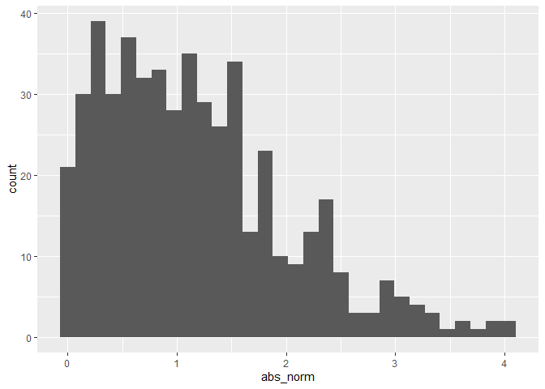

Simple document
================

``` r
library(tidyverse)
```

    ## ── Attaching packages ─────────────────────────────────────── tidyverse 1.3.2 ──
    ## ✔ ggplot2 3.3.6      ✔ purrr   0.3.4 
    ## ✔ tibble  3.1.8      ✔ dplyr   1.0.10
    ## ✔ tidyr   1.2.0      ✔ stringr 1.4.1 
    ## ✔ readr   2.1.2      ✔ forcats 0.5.2 
    ## ── Conflicts ────────────────────────────────────────── tidyverse_conflicts() ──
    ## ✖ dplyr::filter() masks stats::filter()
    ## ✖ dplyr::lag()    masks stats::lag()

I’m an R Markdown document!

# Section 1

Here’s a **code chunk** that samples from a *normal distribution*:

``` r
samp = rnorm(100)
length(samp)
```

    ## [1] 100

# Section 2

I can take the mean of the sample, too! The mean is 0.186.

# Section 3

## Plot from last time

This is going to make a plot! First generate a dataframe, then use
`ggplot` to make a scatterplot.

## Plot from LA

This is a quick kind of solution to the LA: Write a named code chunk
that creates a dataframe comprised of: a numeric variable containing a
random sample of size 500 from a normal variable with mean 1; a logical
vector indicating whether each sampled value is greater than zero; and a
numeric vector containing the absolute value of each element. Then,
produce a histogram of the absolute value variable just created. Add an
inline summary giving the median value rounded to two decimal places.

``` r
la_df =
  tibble(
    norm = rnorm(n = 500, mean = 1),
    logical = norm > 0,
    abs_norm = abs(norm)
  )

ggplot(la_df, aes(x = abs_norm)) + geom_histogram()
```

    ## `stat_bin()` using `bins = 30`. Pick better value with `binwidth`.

<!-- -->
